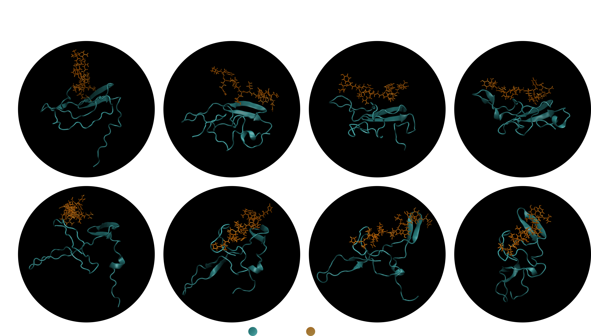

# Omics-to-Peptide-Shuttle Prototype

A version-controlled computational prototype for omics-guided target prioritisation and generative peptide design for brain-targeted therapeutic development.

The workflow connects stroke endothelial transcriptomics, target prioritisation, generative peptide modelling, receptor-aware structural triage, molecular-dynamics feasibility analysis and reward-guided optimisation.

## Computational workflow

**stroke endothelial omics → target prioritisation → peptide generation → receptor-aware structural triage → molecular dynamics → reward-guided optimisation**

## Preliminary computational feasibility

**Current prototype results.** Analysis of 7,627 brain endothelial cells identified eight primary stroke-responsive target hypotheses. The peptide generator produced 100 valid unique peptides, of which 99 were novel relative to the training data. A 1,000-peptide run subsequently yielded 997 unique sequences, with 10 diverse candidates advanced to receptor-aware structural triage. A proof-of-principle reward-guided update demonstrated iterative adaptation of the generator.

These results establish computational feasibility of the workflow but do not demonstrate target binding, BBB transport or therapeutic activity.

## Molecular-dynamics feasibility

Two Ly6a–peptide complexes from the receptor-aware triage were carried forward to explicit-solvent GROMACS simulations. `pep_006` was ranked above `pep_000` by the lightweight ColabFold-derived reward, with much of the separation arising from the interface-confidence term, particularly ipTM (`0.08` vs `0.04`; final reward `0.1779` vs `0.1227`).

**Receptor-aligned structural evolution.** Representative snapshots show how the two complexes evolve over 10 ns. For visualization only, each complete receptor–peptide complex was rigid-body aligned using Ly6a Cα atoms to the `pep_006` 0-ns receptor reference; no positional restraints were applied during production MD.

**MD adds complementary information to the static ranking.** During 5–10 ns, `pep_006` showed lower receptor-fitted peptide RMSD than `pep_000` (`1.416 ± 0.092` vs `1.817 ± 0.076 nm`), indicating closer preservation of its initial receptor-relative pose. In contrast, `pep_000` retained more of its initial contact network (`0.182` vs `0.003`), developed a denser normalized interface (`1.817` vs `0.995` contacts per peptide heavy atom), and maintained a smaller receptor–peptide COM separation (`1.283` vs `1.430 nm`).

The comparison therefore illustrates why score design matters. A structure-prediction confidence metric can favour preservation of the predicted starting pose without necessarily capturing all dynamic interface properties. Future reward design should treat predicted interface confidence, MD pose persistence, contact density, separation and developability as complementary objectives or carefully chosen optimisation/QD descriptors rather than allowing a single metric to dominate downstream reinforcement-learning updates.

## Workflow implementation

1. `01_gse225948_endothelial_receptor_mining.ipynb`  
   Mines stroke-responsive endothelial candidates from public single-cell RNA-seq data and applies surface-accessibility prioritisation.

2. `02_b3pdb_data_downloader.ipynb`  
   Retrieves and cleans B3PDB and CPPsite2 peptide datasets.

3. `03_peptide_transformer_generation_and_scoring.ipynb`  
   Trains a peptide transformer using CPPsite2 pretraining followed by B3PDB fine-tuning and generates candidate sequences.

4. `04_receptor_aware_peptide_triage.ipynb`  
   Performs physicochemical analysis and Ly6a-aware ColabFold structural triage.

5. `04.1_ly6a_peptide_md_feasibility_validation.ipynb`  
   Extends structural triage with preliminary explicit-solvent MD and receptor–peptide interface analysis.

6. `05_reward_guided_peptide_rl_update.ipynb`  
   Demonstrates reward-guided updating of peptide sequence probabilities using receptor-aware computational signals.

7. `06_multi_receptor_structure_triage.ipynb`  
   Extends the workflow to multi-receptor structure-aware triage and reward aggregation.

## Scope and limitations

This repository is a proof-of-concept computational prototype. Generated peptides are computational candidates only, and ColabFold-derived metrics are triage signals rather than binding affinities.

The current structural layer deliberately uses lightweight ColabFold sampling and short, single-trajectory MD simulations. The preliminary Ly6a scaffold does not reproduce the full native disulfide topology, and the receptor is treated as an isolated extracellular construct rather than in its native membrane-anchored orientation. Consequently, membrane-facing surfaces may be artificially solvent accessible.

A more rigorous implementation would use a biologically validated common receptor scaffold with appropriate disulfide connectivity and membrane orientation, deeper structural sampling, multiple starting poses, independent MD replicates and longer simulations where required. These refinements are needed before using MD-derived descriptors as stronger optimisation objectives or experimental predictions.

No experimental binding, BBB transport, toxicity or in vivo efficacy is claimed.

## Outputs

Key processed outputs are generated under:

- `data/processed/`
- `models/`

Large ColabFold and MD result directories are excluded from version control where appropriate.

## Reproducibility

Run notebooks sequentially from `01` to `06`, with `04.1` following receptor-aware triage in notebook `04`.
